# Use Case Diagram - My Wallet

Este diagrama representa todos os casos de uso do sistema **My Wallet**, uma aplicação de gestão financeira pessoal.

## Diagrama de Casos de Uso

```mermaid
graph TB
    User[👤 Usuário]

    subgraph Authentication["🔐 Autenticação"]
        UC01[UC-01: Fazer Login]
        UC02[UC-02: Fazer Logout]
    end

    subgraph Dashboard["📊 Dashboard"]
        UC03[UC-03: Visualizar Dashboard]
        UC04[UC-04: Visualizar Saldo]
        UC05[UC-05: Visualizar Entradas]
        UC06[UC-06: Visualizar Saídas]
        UC07[UC-07: Filtrar por Mês]
        UC08[UC-08: Filtrar por Ano]
        UC09[UC-09: Visualizar Gráfico de Pizza]
        UC10[UC-10: Visualizar Gráfico Barras - Entradas]
        UC11[UC-11: Visualizar Gráfico Barras - Saídas]
        UC12[UC-12: Visualizar Histórico Mensal]
        UC13[UC-13: Visualizar Mensagem Contextual]
    end

    subgraph Transactions["💰 Gestão de Transações"]
        UC14[UC-14: Visualizar Lista de Entradas]
        UC15[UC-15: Visualizar Lista de Saídas]
        UC16[UC-16: Filtrar Transações por Mês]
        UC17[UC-17: Filtrar Transações por Ano]
        UC18[UC-18: Filtrar por Frequência Recorrente]
        UC19[UC-19: Filtrar por Frequência Eventual]
        UC20[UC-20: Alternar Filtro de Frequência]
    end

    subgraph Navigation["🧭 Navegação"]
        UC21[UC-21: Navegar para Dashboard]
        UC22[UC-22: Navegar para Entradas]
        UC23[UC-23: Navegar para Saídas]
    end

    subgraph Settings["⚙️ Configurações"]
        UC24[UC-24: Alternar Tema]
        UC25[UC-25: Persistir Preferência de Tema]
    end

    %% User associations
    User --> UC01
    User --> UC02
    User --> UC03
    User --> UC04
    User --> UC05
    User --> UC06
    User --> UC07
    User --> UC08
    User --> UC09
    User --> UC10
    User --> UC11
    User --> UC12
    User --> UC13
    User --> UC14
    User --> UC15
    User --> UC16
    User --> UC17
    User --> UC18
    User --> UC19
    User --> UC20
    User --> UC21
    User --> UC22
    User --> UC23
    User --> UC24
    User --> UC25

    %% Extend relationships
    UC07 -.->|extends| UC03
    UC08 -.->|extends| UC03
    UC16 -.->|extends| UC14
    UC17 -.->|extends| UC14
    UC18 -.->|extends| UC14
    UC19 -.->|extends| UC14
    UC16 -.->|extends| UC15
    UC17 -.->|extends| UC15
    UC18 -.->|extends| UC15
    UC19 -.->|extends| UC15

    %% Include relationships
    UC01 -.->|includes| UC03
    UC21 -.->|includes| UC03
    UC22 -.->|includes| UC14
    UC23 -.->|includes| UC15

    style User fill:#4A90E2,stroke:#333,stroke-width:3px,color:#fff
    style Authentication fill:#E8F4F8,stroke:#2E86AB,stroke-width:2px
    style Dashboard fill:#F0F8E8,stroke:#6B8E23,stroke-width:2px
    style Transactions fill:#FFF8E8,stroke:#DAA520,stroke-width:2px
    style Navigation fill:#F8E8F0,stroke:#C71585,stroke-width:2px
    style Settings fill:#E8E8F8,stroke:#6A5ACD,stroke-width:2px
```

## Legenda

- **Linhas sólidas (→)**: Associação direta entre o ator e o caso de uso
- **Linhas tracejadas (-.->)**: Relacionamentos de extensão (extends) ou inclusão (includes)
- **Extends**: Caso de uso opcional que estende outro
- **Includes**: Caso de uso obrigatório que é incluído em outro

## Descrição dos Casos de Uso

### 🔐 Autenticação

- **UC-01: Fazer Login** - Usuário autentica-se com email e senha para acessar o sistema
- **UC-02: Fazer Logout** - Usuário encerra sua sessão no sistema

### 📊 Dashboard

- **UC-03: Visualizar Dashboard** - Visualizar visão geral financeira completa
- **UC-04: Visualizar Saldo** - Ver saldo atual (entradas - saídas)
- **UC-05: Visualizar Entradas** - Ver total de entradas do período selecionado
- **UC-06: Visualizar Saídas** - Ver total de saídas do período selecionado
- **UC-07: Filtrar Dashboard por Mês** - Selecionar mês específico para análise
- **UC-08: Filtrar Dashboard por Ano** - Selecionar ano específico para análise
- **UC-09: Visualizar Gráfico de Pizza** - Ver relação percentual entre entradas e saídas
- **UC-10: Visualizar Gráfico de Barras - Entradas** - Ver análise de entradas recorrentes vs eventuais
- **UC-11: Visualizar Gráfico de Barras - Saídas** - Ver análise de saídas recorrentes vs eventuais
- **UC-12: Visualizar Histórico Mensal** - Ver evolução financeira ao longo do ano selecionado
- **UC-13: Visualizar Mensagem Contextual** - Ver feedback automático baseado no estado financeiro

### 💰 Gestão de Transações

- **UC-14: Visualizar Lista de Entradas** - Ver todas as transações de entrada detalhadas
- **UC-15: Visualizar Lista de Saídas** - Ver todas as transações de saída detalhadas
- **UC-16: Filtrar Transações por Mês** - Filtrar lista por mês específico
- **UC-17: Filtrar Transações por Ano** - Filtrar lista por ano específico
- **UC-18: Filtrar por Frequência Recorrente** - Mostrar apenas transações recorrentes
- **UC-19: Filtrar por Frequência Eventual** - Mostrar apenas transações eventuais
- **UC-20: Alternar Filtro de Frequência** - Ativar/desativar filtros de frequência

### 🧭 Navegação

- **UC-21: Navegar para Dashboard** - Acessar página principal do dashboard
- **UC-22: Navegar para Entradas** - Acessar página de lista de entradas
- **UC-23: Navegar para Saídas** - Acessar página de lista de saídas

### ⚙️ Configurações

- **UC-24: Alternar Tema** - Alternar entre tema claro e escuro
- **UC-25: Persistir Preferência de Tema** - Salvar preferência de tema no navegador

## Notas Importantes

1. **Pré-requisitos**: O caso de uso UC-01 (Fazer Login) é pré-requisito para todos os outros casos de uso, exceto UC-02 (Fazer Logout).

2. **Relacionamentos de Extensão**: Os filtros (UC-07, UC-08, UC-16, UC-17, UC-18, UC-19) são extensões opcionais dos casos de uso principais.

3. **Relacionamentos de Inclusão**: O login (UC-01) inclui o acesso ao dashboard (UC-03), e a navegação inclui os casos de uso correspondentes.
