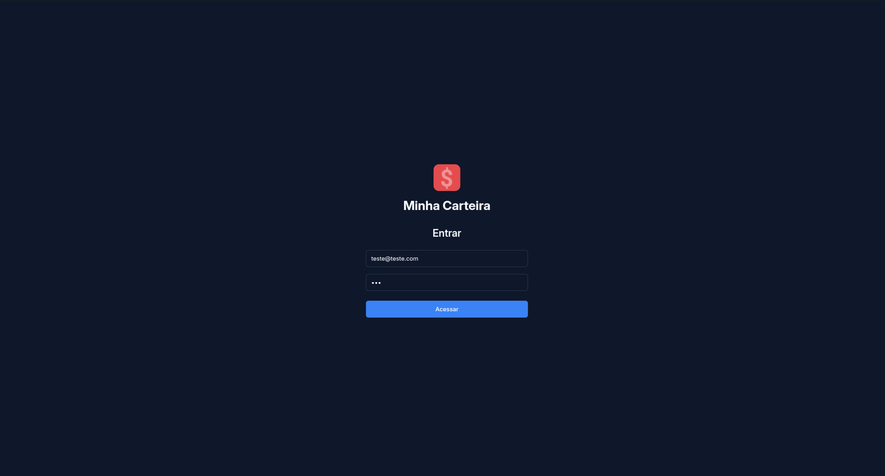
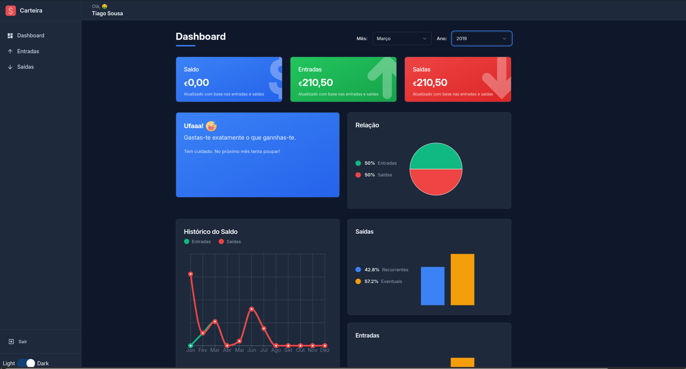
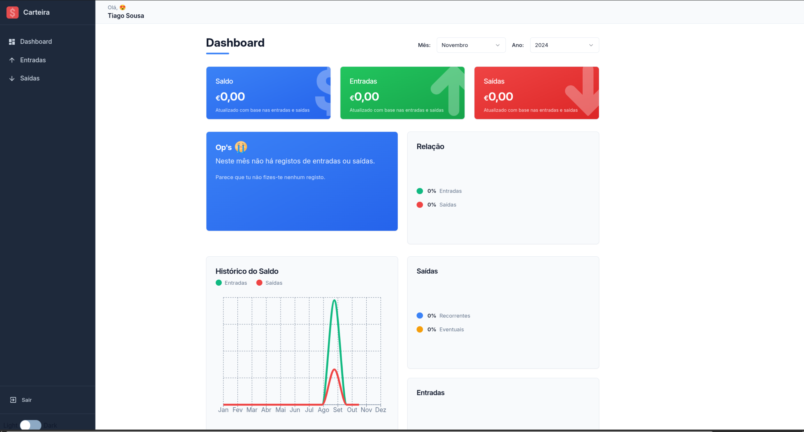
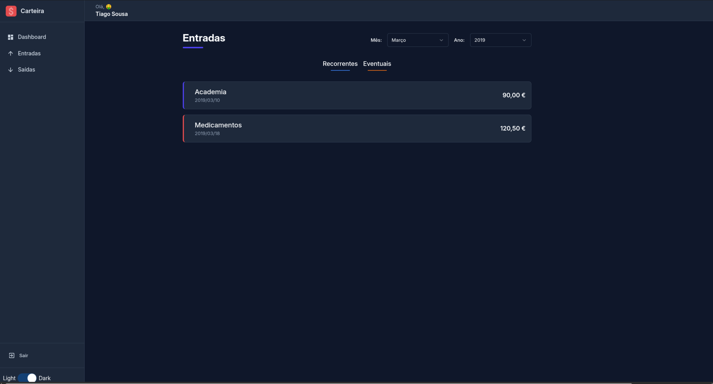
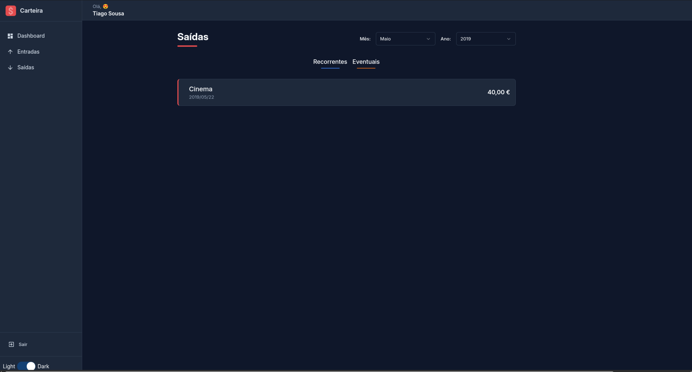

# 💰 My Wallet

A modern and responsive web application for personal financial management, developed with React and TypeScript. **My Wallet** allows users to track financial income and expenses, visualize data through interactive charts, and manage their budget efficiently.

---

## 📸 Screenshots

### Login Page


### Dashboard - Dark Mode


### Dashboard - Light Mode


### Income List


### Expenses List


---

## ✨ Key Features

- 📊 **Interactive Dashboard** - Real-time financial overview with beautiful charts and graphs
- 💰 **Balance Tracking** - Monitor your income, expenses, and balance at a glance
- 📈 **Data Visualization** - Pie charts, bar charts, and line graphs for comprehensive analysis
- 🔍 **Smart Filtering** - Filter transactions by month, year, and frequency (recurring/one-time)
- 🌓 **Dark/Light Theme** - Toggle between themes with smooth transitions
- 📱 **Responsive Design** - Works perfectly on desktop, tablet, and mobile devices
- 🔐 **Secure Authentication** - Simple and secure login system

---

## 🚀 Quick Start

### Prerequisites

- Node.js (version 18 or higher)
- npm or yarn

### Installation Steps

1. **Navigate to the project folder**
```bash
cd minha-carteira
```

2. **Install dependencies**
```bash
npm install
```

3. **Start the development server**
```bash
npm run dev
```

4. **Open your browser**
```
http://localhost:5173
```

### Login Credentials

- **Email**: `teste@teste.com`
- **Password**: `123`

---

## 🎯 Main Features Explained

### Dashboard Overview

The main dashboard provides a comprehensive view of your financial status:

- **Balance Card**: Shows your current balance (income minus expenses)
- **Income Card**: Displays total income for the selected period
- **Expenses Card**: Shows total expenses for the selected period
- **Contextual Messages**: Smart feedback based on your financial situation
- **Charts**: Visual representations of your financial data

### Interactive Charts

- **Pie Chart**: Visualizes the relationship between income and expenses
- **Bar Charts**: Compare recurring vs one-time transactions
- **Line Chart**: Track your financial evolution month by month

### Transaction Management

- View detailed lists of all income and expenses
- Filter by month and year for specific periods
- Toggle between recurring and one-time transactions
- See formatted currency and dates for easy reading

---

## 📋 Table of Contents

- [Screenshots](#-screenshots)
- [Key Features](#-key-features)
- [Quick Start](#-quick-start)
- [Main Features Explained](#-main-features-explained)
- [About the Project](#-about-the-project)
- [Installation and Execution](#-installation-and-execution)
- [Authentication](#-authentication)
- [Technologies Used](#-technologies-used)
- [Project Structure](#-project-structure)
- [Application Flow](#-application-flow)

---

## 🎯 About the Project

**My Wallet** is a complete financial dashboard that offers an intuitive interface to:

- View current balance, income, and expenses
- Analyze spending through interactive charts
- Filter transactions by month/year
- Distinguish between recurring and one-time expenses
- Track monthly financial history
- Toggle between light and dark themes

---

## 🚀 Installation and Execution

### Prerequisites

- Node.js (version 18 or higher)
- npm or yarn

### Steps

1. **Clone the repository and navigate to the folder**

```bash
cd minha-carteira
```

2. **Install dependencies**

```bash
npm install
```

3. **Run the development server**

```bash
npm run dev
```

4. **Access the application**

```
http://localhost:5173
```

### Available Scripts

- `npm run dev` - Starts development server
- `npm run build` - Creates production build
- `npm run preview` - Preview production build
- `npm run lint` - Runs ESLint to check code

---

## 🔐 Authentication

### Default Credentials

- **Email**: `teste@teste.com`
- **Password**: `123`

### Authentication System

Authentication is implemented through a Context API (`AuthProvider`):

- Stores login state in `localStorage`
- Protects routes based on `logged` state
- Available functions: `signIn()` and `signOut()`

### Customization

To integrate with a real backend, modify the `useAuth` hook in `src/hooks/auth.tsx`:

- Replace static validation with API calls
- Implement JWT tokens or sessions
- Add more robust error handling

---

## 🛠 Technologies Used

### Core

- **React 18.3.1** - JavaScript library for building user interfaces
- **TypeScript 5.6.2** - JavaScript superset with static typing
- **Vite 6.0.1** - Fast build tool and development server

### Routing

- **React Router DOM 6.28.0** - Declarative routing for React applications

### Styling

- **Tailwind CSS 3.4.18** - Utility-first CSS framework
- **PostCSS 8.5.6** - Tool for transforming CSS
- **Autoprefixer 10.4.21** - Automatically adds vendor prefixes

### UI Components

- **Radix UI** - Accessible component library:
  - `@radix-ui/react-dialog` - Modal dialogs
  - `@radix-ui/react-dropdown-menu` - Dropdown menus
  - `@radix-ui/react-select` - Custom selectors
  - `@radix-ui/react-tabs` - Tab components
  - `@radix-ui/react-toast` - Toast notifications
- **Lucide React 0.548.0** - Icon library
- **React Icons 5.4.0** - Additional icon collection

### Data Visualization

- **Recharts 2.15.0** - Chart library for React
- **React CountUp 6.5.3** - Numeric counter animation

### Utilities

- **UUIDv4 6.2.13** - Unique identifier generation
- **Class Variance Authority 0.7.1** - Class variant management
- **clsx 2.1.1** - Utility for constructing CSS classes
- **Tailwind Merge 3.3.1** - Intelligent Tailwind class merging
- **React Switch 7.1.0** - Toggle switch component

### Development

- **ESLint 9.15.0** - Linter for JavaScript/TypeScript
- **TypeScript ESLint 8.15.0** - TypeScript-specific linter
- **Vite Plugin React SWC 3.5.0** - Vite plugin using SWC for Fast Refresh

---

## 📁 Project Structure

```
minha-carteira/
├── src/
│   ├── assets/              # Static images and icons
│   ├── components/          # Reusable React components
│   │   ├── Aside/          # Side navigation bar
│   │   ├── BarChartBox/     # Bar chart
│   │   ├── Button/          # Custom button
│   │   ├── Content/         # Content container
│   │   ├── ContentHeader/   # Page header
│   │   ├── HistoryBox/      # History chart
│   │   ├── HistoryFinanceCard/ # Transaction card
│   │   ├── Input/           # Custom input
│   │   ├── Layout/          # Main layout
│   │   ├── MainHeader/      # Main header
│   │   ├── MessageBox/      # Message box
│   │   ├── PieChartBox/     # Pie chart
│   │   ├── SelectInput/     # Custom select
│   │   ├── Toggle/          # Toggle switch
│   │   ├── WalletBox/       # Balance/income/expenses card
│   │   └── ui/              # shadcn/ui components
│   ├── hooks/               # Custom React hooks
│   │   ├── auth.tsx         # Authentication hook
│   │   └── theme.tsx        # Theme hook
│   ├── lib/                 # Utilities and libraries
│   ├── pages/               # Application pages
│   │   ├── Dashboard/       # Main dashboard
│   │   ├── List/            # List page
│   │   └── SignIn/          # Login page
│   ├── repositories/        # Data repositories
│   │   ├── expenses.ts      # Expense data
│   │   └── gains.ts         # Income data
│   ├── routes/              # Route configuration
│   │   ├── app.routes.tsx   # Authenticated routes
│   │   ├── auth.routes.tsx  # Authentication routes
│   │   └── index.tsx        # Main router
│   ├── styles/              # Global styles and themes
│   │   ├── themes/          # Theme definitions
│   │   └── GlobalStyles.ts  # Global styles
│   ├── utils/               # Utility functions
│   │   ├── emojis.ts        # Emoji utilities
│   │   ├── formatCurrency.ts # Currency formatting
│   │   ├── formatDate.ts    # Date formatting
│   │   └── months.ts        # Months list
│   ├── App.tsx              # Root application component
│   ├── main.tsx             # Application entry point
│   └── index.css            # Global CSS styles
├── public/                  # Public static files
├── dist/                    # Production build
├── package.json             # Dependencies and scripts
├── tsconfig.json            # TypeScript configuration
├── vite.config.ts           # Vite configuration
├── tailwind.config.js       # Tailwind configuration
└── postcss.config.js        # PostCSS configuration
```

---

## 🔄 Application Flow

### 1. Initialization

```
main.tsx
  ├── ThemeProvider (manages light/dark theme)
  ├── AuthProvider (manages authentication)
  └── App (main component)
```

### 2. Route System

The application uses conditional routes based on authentication state:

```typescript
Routes (index.tsx)
  ├── Checks logged state via useAuth()
  │
  ├── If logged === true:
  │   └── AppRoutes (protected routes)
  │       ├── / → Dashboard
  │       └── /list/:type → List (income or expenses)
  │
  └── If logged === false:
      └── AuthRoutes (public routes)
          └── / → SignIn
```

### 3. Authentication Flow

1. **User accesses the application**
   - System checks `localStorage` for existing session
   - If no session exists, redirects to `/` (SignIn)

2. **Login (SignIn)**
   - User enters email and password
   - `signIn()` validates credentials (currently: `teste@teste.com` / `123`)
   - If valid: saves to `localStorage` and updates `logged` state
   - Routes are automatically redirected to Dashboard

3. **Logout**
   - `signOut()` removes data from `localStorage`
   - `logged` state is updated to `false`
   - Routes are redirected to SignIn

### 4. Dashboard Flow

1. **Data Loading**
   - Dashboard filters data from `expenses.ts` and `gains.ts`
   - Uses `useMemo` for optimized calculations based on `monthSelected` and `yearSelected`

2. **Calculations Performed**
   - `totalExpenses`: Sum of all expenses for selected month/year
   - `totalGains`: Sum of all income for selected month/year
   - `totalBalance`: Difference between income and expenses
   - `message`: Contextual message based on balance
   - `relationExpensesVersusGains`: Data for pie chart
   - `historyData`: Data for monthly history chart
   - `relationExpensevesRecurrentVersusEventual`: Expense analysis by frequency
   - `relationGainsRecurrentVersusEventual`: Income analysis by frequency

3. **Rendered Components**
   - **WalletBox** (3 cards): Balance, Income, Expenses
   - **MessageBox**: Contextual message with icon
   - **PieChartBox**: Pie chart (Income vs Expenses)
   - **HistoryBox**: Line chart with monthly history
   - **BarChartBox** (2): Bar charts for frequencies

### 5. List Page Flow

1. **Route Parameters**
   - `/list/entry-balance` → Lists income
   - `/list/exit-balance` → Lists expenses

2. **Filters**
   - Month and year selection via `SelectInput`
   - Frequency filters (recurring/one-time) via toggle buttons

3. **Rendering**
   - `useEffect` filters data based on selected filters
   - Each item is rendered as `HistoryFinanceCard`
   - Data formatted with `formatCurrency` and `formatDate`

### 6. Theme System

1. **Initialization**
   - Checks `localStorage` for saved theme
   - If it doesn't exist, uses dark theme as default

2. **Theme Change**
   - `toggleTheme()` toggles between light and dark
   - Saves preference to `localStorage`
   - Applies `dark` class to root element when necessary

3. **Application**
   - Tailwind CSS automatically applies styles based on `dark` class
   - Smooth transitions between themes

---

## 📊 Data Repositories

Currently, data is stored in TypeScript files:

- `src/repositories/expenses.ts` - Expense list
- `src/repositories/gains.ts` - Income list

Each item has the following structure:

```typescript
{
  description: string;    // Transaction description
  amount: string;        // Amount (string for precision)
  type: string;          // "entrada" or "saída"
  frequency: string;     // "recorrente" or "eventual"
  date: string;          // Date in YYYY-MM-DD format
}
```

### Backend Integration

To integrate with a real API:

1. Create services in `src/services/`
2. Replace repository imports with API calls
3. Implement loading states and error handling

---

**Developed with ❤️ using React + TypeScript + Vite**
